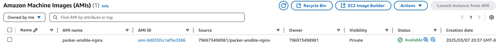
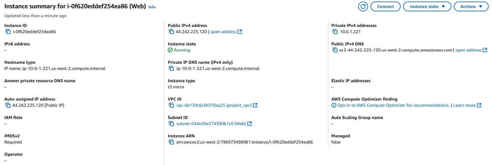
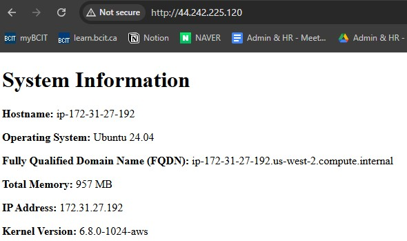

### Members: Keziah Wacnang, Austin Park
---
**To generate ssh key pair:**
* `ssh-keygen -t ed25519 -f ~/.ssh/aws-4640 -C "Lab09"`

**Using the `import_lab_key` script for AWS**
* `./import_lab_key ~/.ssh/aws-4640.pub`
* this will import the key to your aws

**To run the included Packer**
* `cd packer` - to enter packer directory first
* `packer init .` to initialize the directory
* `packer build .` to start the build process

**To run the included terraform (to create the two EC2 instances)**
* `cd terraform` - to enter terraform directory first
* `terraform init` - to initialize the directory
* `terraform validate` - to check validity of config
* `terraform plan` - to do a dry run
* `terraform apply` - to provision

### Screenshots:
---

**Resources:**
* https://developer.hashicorp.com/packer/docs/templates/hcl_templates/blocks/packer
* https://developer.hashicorp.com/packer/docs/templates/hcl_templates/blocks/source
* https://developer.hashicorp.com/packer/docs/templates/hcl_templates/blocks/build